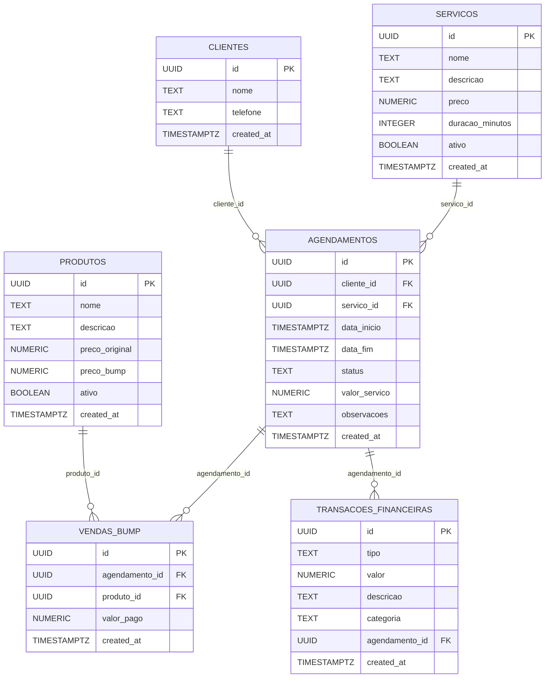

# Executive Summary

This report defines an **enhanced AI prompt** for building the AlcateiaBarber MVP, ensuring all original constraints and incorporating modern best practices. We explicitly list the required stack and features (Next.js App Router with TypeScript, Tailwind CSS, Supabase/Postgres with RLS, Schedule-X, React Hook Form, Zod, Lucide icons, Recharts for charts, strict TS, mobile-first design, branded UI). We then detail improvements across architecture, API design, database schema (types, indexes, constraints), booking concurrency (using PostgreSQL exclusion constraints), timezone handling (store UTC), idempotency, testing (unit, integration, E2E), and CI/CD (GitHub Actions + Vercel/Supabase). We include a **step-by-step implementation roadmap** (sprints/phases with tasks and acceptance criteria) visualized in a Mermaid Gantt chart. We present comparison tables (Schedule-X vs FullCalendar, Supabase vs Firebase, Recharts vs Chart.js) with pros/cons and recommendations. We illustrate the database design with a Mermaid ER diagram and suggest sample SQL migrations. Finally, we provide the **improved AI prompt** (for a Lovable/Bolt-style code-generation AI) in both Portuguese and English, broken into incremental tasks (project scaffold, auth+RLS, migrations+seed, booking UI, order bump, Schedule-X integration, admin dashboard, finance flows, tests) with clear input/output expectations, example API signatures, Zod schemas, and sample data. An accessible design system and performance/security best practices are emphasized. 

**Key recommendations:** Use Next.js 15 App Router for feature-based folder structure; enable and test Supabase RLS on all tables with policies tying `auth.uid()` to ownership; leverage Server Actions for in-app mutations and API Routes for third-party/webhooks; apply PostgreSQL exclusion constraints to prevent overlapping bookings; store all timestamps with time zone (`timestamptz` in UTC) and handle timezone conversions in the UI; and adopt continuous integration/deployment with Vercel (which offers zero-config deployment and global edge CDN) and GitHub Actions for automated tests. WCAG accessibility (24×24px tap targets, visible focus) and OWASP security guidelines (e.g. RLS for access control) are mandated.

**Developer Checklist:**

- **Stack & Features:** Confirm use of Next.js (App Router) + TS, Tailwind CSS, Supabase (Postgres) w/ RLS, Schedule-X, React Hook Form, Zod, Lucide, Recharts, strict TS mode, mobile-first/responsive design, branded colors/typography/animations.  
- **Folder Architecture:** Follow Next.js best practices; group routes and layouts under `app/`, separate UI components, hooks, utils (see example structure).  
- **API Patterns:** Use Next.js Server Actions (`'use server'`) for form submissions and data mutations (type-safe, in-app) and API Routes (`app/api/*`) for external endpoints or webhooks.  
- **Database & RLS:** Define DB schema with appropriate types (UUID PKs, `timestamptz` for dates, DECIMAL for money) and constraints (NOT NULL, UNIQUE, FK). Enable RLS on each table and write policies linking rows to `auth.uid()`.  
- **Booking Logic:** Implement exclusion constraints in Postgres (GiST with `btree_gist`) on `(profissional_id, tsrange(data_inicio, data_fim))` to avoid overlapping appointments.  
- **Timezone Handling:** Store all datetimes in UTC (`timestamp with time zone`); convert to local time on the client.  
- **Idempotency:** For critical actions (e.g. payment/order bump), use idempotency keys or unique fields to prevent duplicate processing.  
- **Testing:** Write unit/integration tests (Jest, Testing Library) for components and logic; end-to-end tests (Playwright/Cypress) for booking and checkout flows. Integrate linting, type-checking, and tests into CI (GitHub Actions).  
- **CI/CD & Deployment:** Use GitHub Actions with jobs for build, test, lint, type-check, and Supabase migrations. Deploy to Vercel for Next.js (automatic PR previews, global CDN), and use the Supabase CLI for migrations. Manage secrets via environment variables in Vercel (prefix client keys with `NEXT_PUBLIC_`).  
- **Accessibility:** Follow WCAG AA (semantic HTML, alt text, keyboard navigation, 24×24px targets, visible focus). Run axe/Lighthouse audits.  
- **Performance:** Optimize Core Web Vitals (React Compiler, code-splitting, ISR/SSR for key pages). Memoize components and use server components for static content.  
- **Security:** Follow OWASP Top 10 (no injection, enforce RLS/ACLs, sanitize inputs, use HTTPS, HttpOnly cookies, CSP). Audit dependencies.  

## Original MVP Constraints

The AI prompt must **explicitly include** all original MVP specifications as requirements. These constraints are: 

- **Framework & Language:** Next.js (App Router, version 15+) with **TypeScript** (strict mode). Use React Server Components where appropriate and differentiate client components (`'use client'`) for interactive parts.  
- **Styling:** Tailwind CSS for a mobile-first, responsive design. A consistent design system is defined: specific color palette, typography, border radii, and animations (to match AlcateiaBarber’s brand).  
- **Database & Backend:** Supabase (Postgres) as the backend database with **Row-Level Security (RLS)**. Use `uuid` PKs, `timestamptz` for date-times, and appropriate FK relations. Every table must have RLS enabled.  
- **Authentication:** Supabase Auth for user accounts (e.g. one “barber” account who manages the shop). Implement signup/login flows and tie all data to the user via RLS.  
- **Scheduling:** **Schedule-X** library for the calendar/booking UI. Provide at least day/week/month views for selecting appointment slots.  
- **Forms & Validation:** React Hook Form for building forms, with Zod schemas for runtime validation. (E.g., booking form schema, client info schema, etc.)  
- **Icons & Charts:** Lucide icon set for UI icons. Recharts library for data visualization (sales, appointments statistics).  
- **Coding Standards:** Strict TypeScript. Functional React components. Modular folder structure. No disallowed libraries.  
- **UX Flow:** Core flows include: service listing, booking calendar, checkout with “order bump” upsell, admin dashboard (manage services, bookings, products), and financial reporting.  

These items must be *preserved verbatim* as requirements in the prompt (e.g. “use Next.js App Router”, “use Supabase RLS”, etc.), so the AI knows they are non-negotiable.

## Technical Improvements & Best Practices

We incorporate best practices and recent recommendations for each aspect of the stack:

- **Project Architecture:** Organize code by feature and function. With Next.js App Router, the `app/` directory serves as the route tree. Follow an example layout:  
  ```text
  my-nextjs-app/
  ├── app/
  │   ├── layout.js
  │   ├── page.js
  │   ├── services/             # pages related to services
  │   │   ├── page.js
  │   │   └── [id]/page.js
  │   ├── bookings/             # public booking flow
  │   │   ├── page.js
  │   │   └── calendar.js
  │   ├── admin/                # admin dashboard
  │   │   ├── layout.js
  │   │   ├── page.js
  │   │   └── finance/page.js
  │   └── api/                 # Next.js Route Handlers (optional)
  │       └── auth/route.js
  ├── components/              # shared React components
  ├── hooks/                   # custom hooks
  ├── lib/                     # utility libraries (e.g. Supabase client)
  ├── styles/                  # global CSS or Tailwind config
  ├── public/                  # static assets
  └── tests/                   # unit and integration tests
  ```  
  This follows Next.js best practices (nested layouts, clear separation).

- **API Patterns:** Use Next.js **Server Actions** (introduced in App Router) for in-app mutations and form submissions, since they allow calling server code directly from React components with full type-safety. For example, attach a `'use server'` function to a booking form. Reserve traditional **API Routes** (in `app/api/.../route.js`) for external needs (webhooks, third-party calls, REST endpoints). In summary: **Server Actions** for UI-driven logic; **API Routes** for integration points.

- **Authentication & Authorization:** Integrate Supabase Auth. After login, use `auth.uid()` to scope data. For each table, enable RLS and write policies. For example, to let a user see only their “todos”, a policy would be:  
  ```sql
  CREATE POLICY "Users can view own todos"
    ON todos FOR SELECT
    USING (auth.uid() = user_id);
  ```  
  This makes every SELECT implicitly `WHERE auth.uid() = todos.user_id`. We will write similar policies for services, bookings, products, etc., tying records to the owner’s UID. Supabase docs strongly recommend enabling RLS on all tables and revoking broad anon access.

- **Database Schema:** Refine data types and constraints. Use `UUID PRIMARY KEY DEFAULT gen_random_uuid()`. Use `TEXT` or `VARCHAR` with NOT NULL where needed. For money/prices, use `NUMERIC(10,2)` or `DECIMAL`. Add sensible defaults (e.g. `active BOOLEAN DEFAULT TRUE`, `created_at TIMESTAMPTZ DEFAULT NOW()`). Example migration snippet:  
  ```sql
  CREATE TABLE servicos (
    id UUID PRIMARY KEY DEFAULT gen_random_uuid(),
    nome TEXT NOT NULL,
    descricao TEXT,
    preco NUMERIC(10,2) NOT NULL,
    duracao_minutos INTEGER NOT NULL,
    ativo BOOLEAN NOT NULL DEFAULT true,
    created_at TIMESTAMPTZ NOT NULL DEFAULT now()
  );
  ```  
  Also define indexes on foreign keys and unique columns. (For instance, add `UNIQUE` on any field like service code if needed.)

- **Booking Concurrency:** Prevent double-booking via a database constraint. PostgreSQL **exclusion constraints** are ideal: they enforce no overlapping time ranges for the same barber. For example:  
  ```sql
  CREATE EXTENSION IF NOT EXISTS btree_gist;  -- for using = on UUID in GiST
  ALTER TABLE agendamentos
    ADD CONSTRAINT no_overlap
    EXCLUDE USING GIST (
      profissional_id WITH =,
      tsrange(data_inicio, data_fim) WITH &&
    );
  ```  
  This says “no two rows may have the same `profissional_id` and overlapping time ranges”. Unlike serializable isolation, an exclusion constraint locks only relevant rows and fails fast on conflict.

- **Time Zones:** Store all timestamps in UTC (`TIMESTAMP WITH TIME ZONE`). In the UI, convert to the user’s local zone (e.g. with `Intl.DateTimeFormat` or a library like date-fns-tz). Normalize any time input to UTC before saving. For recurring appointments or calendar display, use a timezone-aware approach as needed (Schedule-X premium even has timezone support).

- **Idempotency:** For actions like checkout/order bump or payment callbacks, ensure idempotent handling. Use unique client-provided tokens or deduplication keys in requests so that retries (due to network issues) don’t double-charge or double-create records. For example, generate an `idempotency_key` in the booking payment flow and check it server-side. (Supabase has a Service Role key for trusted operations, but still handle duplicates.)

- **Testing Strategy:** Develop comprehensive tests. **Unit tests** (Jest/RTL) for components and utility functions (e.g. booking calculations, form validation). **Integration tests** for form flows (React Testing Library) to assert UI and API interaction. **End-to-end tests** (Cypress or Playwright) to simulate user scenarios: booking a service, processing checkout, admin actions. Automate these in CI. Include linting and type-check (`tsc`) in the pipeline. Example: a GitHub Actions job might run `npm test`, `npm run lint`, and `npm run type-check`.

- **CI/CD and Deployment:** Use GitHub Actions and Vercel. A typical CI workflow (trigger on push) will: install, run lint/type-check, execute tests, then deploy if all pass. We can use the `Supabase CLI` for migrations: e.g. `supabase login && supabase db push` or `supabase db diff && supabase db migrate deploy`. The guide above demonstrates deploying via Actions (including a step using `amondnet/vercel-action` with Vercel tokens). For production, use Vercel (the creators’ platform) which offers **zero-config deployment, automatic HTTPS, preview deployments on PRs, and global edge CDN**. Store **environment variables** (Supabase URLs/keys) securely in Vercel’s dashboard, prefixing client keys with `NEXT_PUBLIC_`. Never hard-code secrets. Use atomic deploys (Vercel does) and include a rollback plan (the sample suggests running `vercel rollback` and tracking migration rollback scripts).

- **Accessibility:** Follow WCAG AA and best practices from day one. Use semantic HTML (e.g. `<button>`, `<label>`, `<nav>`, etc.), include `aria-` attributes as needed, and ensure keyboard navigation. Enforce touch target sizes ≥24×24px and visible focus outlines. All images/icons need alt text (for Lucide icons, include an accessible label). Avoid drag-only interactions. Use tools like `eslint-plugin-jsx-a11y` and axe for automated checks. 

- **Performance:** Aim for excellent Core Web Vitals. Use server-side rendering or ISR for pages like service listing and admin dashboard to improve LCP. Lazy-load images and schedule data. Use the React Compiler (or React lazy) to auto-memoize pure components. Split bundles so critical code loads first, and only load Schedule-X or chart libraries on demand. Cache common queries (e.g. static service list). Follow general web best-practices (compact assets, gzip, fast fonts). Monitor performance after launch (e.g. Vercel Analytics, RUM).

- **Security:** Follow **OWASP Top 10** for web apps. Key measures:  
  - **Injection:** Always use parameterized queries or Supabase client (which does this). Validate all inputs with Zod to avoid XSS or SQL injection. Never use `dangerouslySetInnerHTML` without sanitization.  
  - **Broken Access:** Rely on RLS policies to enforce data access. For server actions/API routes, double-check server code never trusts client-sent user IDs.  
  - **Authentication & Session:** Use secure cookies or tokens from Supabase Auth. Protect pages with SSR checks or middleware (e.g. redirect unauthenticated access to login).  
  - **Misconfiguration:** Limit CORS origins, turn off default anon privileges (Supabase project disables anon from custom domains if RLS is off).  
  - **Dependency Safety:** Keep libraries updated, run `npm audit`, and use tools like Snyk if possible.

Throughout development, cite official sources and high-quality posts (e.g. Supabase docs, Next.js docs, LogRocket and Zapier blogs) to inform these practices.

## Implementation Plan & Sprint Timeline

We propose a phased roadmap with clear deliverables and acceptance criteria. Each **sprint** lasts ~2 weeks (adjust as needed). The timeline below is a **Mermaid Gantt chart** of the main phases:

```mermaid
gantt
    title AlcateiaBarber Development Sprints
    dateFormat  YYYY-MM-DD
    section Phase 1: Setup & Auth
    Project Scaffold & Environment   :a1, 2026-09-01, 2w
    Auth & Supabase RLS Setup         :after a1, 1w
    section Phase 2: Booking Flow
    Public Booking UI (Services)      :2026-09-15, 2w
    Order Bump Component              :after a3, 1w
    section Phase 3: Calendar & Admin
    Schedule-X Integration (Calendar) :2026-10-06, 2w
    Admin Dashboard UI                :after a5, 2w
    section Phase 4: Finance & Charting
    Sales & Transactions Charts       :2026-10-27, 1w
    Business Logic (Reporting)        :same a7, 1w
    section Phase 5: Finalization
    Testing, QA & CI/CD               :2026-11-03, 2w
    Launch Preparations               :2026-11-17, 1w
```

**Phase 1 (2–3 weeks):**  
- **Deliverables:** Next.js project scaffold, Tailwind config, linting/formatting setup, Git repo. Login/signup pages with Supabase Auth. RLS policies enabled on tables (e.g. `usuarios`, `servicos`). A seed admin user.  
- **Tasks:** Initialize Next app (`npx create-next-app --ts`), install dependencies (Supabase JS, Zod, React Hook Form, Lucide, Schedule-X, Recharts). Configure Supabase client. Implement basic layout and header. Create Auth pages (using Supabase UI or custom). Write migration scripts for tables (clientes, servicos, agendamentos, produtos, vendas_bump, transacoes_financeiras). Enable RLS and add example policies tying to `auth.uid()`.  
- **Acceptance:** Can register/login and see authenticated UI. Data tables exist and RLS prevents cross-user access (test by logging in as different user). Lint/Type-check clear.  

**Phase 2 (3 weeks):**  
- **Deliverables:** Public flow for customers: service listing page (with mobile layout), appointment scheduling page using Schedule-X or a simple selection for date/time. Order bump feature at checkout (select extra product). Form validation with Zod.  
- **Tasks:** Create `/services` page listing `servicos` from DB. Build booking form: select service, date/time (use Schedule-X calendar or dropdowns). After picking slot, show checkout form (collect client info using React Hook Form + Zod). Include an optional **order bump**: e.g. offer a product (from `produtos`) and update total instantly. Implement instant total calculation in UI. On submit, call a Server Action or API to create a booking and any bump sale.  
- **Acceptance:** A demo customer can select a service, pick a time (no overlap), fill in details, opt-in to a bump, and submit. The booking and bump are stored in DB (`agendamentos` & `vendas_bump`), respecting RLS. UI updates totals correctly. Validation errors are shown (e.g. required fields, valid email).  

**Phase 3 (3–4 weeks):**  
- **Deliverables:** Admin interfaces: a Schedule-X calendar view showing existing bookings (admin-only), and basic management pages (list/add/edit `servicos`, `produtos`).  
- **Tasks:** Integrate Schedule-X to display events from `agendamentos`. Implement admin dashboard (protected route) where the barber can see bookings by day/week. Add pages to manage services and products (create/update/delete). Ensure RLS policies allow the owner to CRUD their data.  
- **Acceptance:** Admin login shows a calendar with all bookings. Admin can add new services/products via forms (with validation). Updating data updates the DB. All pages are responsive and follow design guidelines.  

**Phase 4 (2–3 weeks):**  
- **Deliverables:** Financial reporting flows: chart of sales over time, total revenue, etc., using Recharts. Data endpoints to fetch aggregated stats.  
- **Tasks:** Write API routes or server actions to aggregate transactions (from `transacoes_financeiras` or join bookings). Build a `/admin/finance` page showing charts (bar/line) for daily/weekly sales and bump revenue. Use Zod to validate any filters.  
- **Acceptance:** The admin can view charts (e.g. monthly revenue, number of bookings) that update as DB data changes. Chart components render correctly on client (note: include them in client components with `'use client'` since Recharts is SVG-based and SSR-friendly).  

**Phase 5 (2–3 weeks):**  
- **Deliverables:** Comprehensive testing suite, CI/CD pipeline, performance/accessibility audit, final bugfixes.  
- **Tasks:** Add tests for key flows (Jest for utilities, RTL for components, Cypress for end-to-end). Set up GitHub Actions to run tests, linters, type checks on every push. Configure Vercel auto-deploy. Write documentation (README, API specs). Address a11y issues (run axe, fix contrast).  
- **Acceptance:** All tests pass on CI. A PR deployment on Vercel works. Lighthouse metrics are good (fast LCP, no major a11y violations). The product flow works end-to-end. Ready for launch.

## Database ER Diagram

Below is a Mermaid ER diagram of the core schema (tables and relationships). Each table has a UUID PK and relevant fields. Foreign keys are shown by relationships (||--o{ denotes one-to-many):



**Sample SQL Migration Statements:**  

```sql
-- Example migration for services and enabling RLS policy
CREATE TABLE servicos (
  id UUID PRIMARY KEY DEFAULT gen_random_uuid(),
  nome TEXT NOT NULL,
  descricao TEXT,
  preco NUMERIC(10,2) NOT NULL,
  duracao_minutos INTEGER NOT NULL,
  ativo BOOLEAN NOT NULL DEFAULT true,
  created_at TIMESTAMPTZ NOT NULL DEFAULT now()
);
ALTER TABLE servicos ENABLE ROW LEVEL SECURITY;
CREATE POLICY "Barber can manage own services" ON servicos
  USING (auth.uid() = owner_id);

-- Bookings table with exclusion constraint to avoid overlaps
CREATE EXTENSION IF NOT EXISTS btree_gist;
CREATE TABLE agendamentos (
  id UUID PRIMARY KEY DEFAULT gen_random_uuid(),
  cliente_id UUID REFERENCES clientes(id) ON DELETE CASCADE,
  servico_id UUID REFERENCES servicos(id) ON DELETE CASCADE,
  data_inicio TIMESTAMPTZ NOT NULL,
  data_fim TIMESTAMPTZ NOT NULL,
  status TEXT NOT NULL DEFAULT 'agendado',
  valor_servico NUMERIC(10,2) NOT NULL,
  observacoes TEXT,
  created_at TIMESTAMPTZ NOT NULL DEFAULT now()
);
ALTER TABLE agendamentos ENABLE ROW LEVEL SECURITY;
CREATE POLICY "User can book appointments" ON agendamentos
  USING (auth.uid() = cliente_id);

-- Exclusion constraint: no overlapping booking for same barber
ALTER TABLE agendamentos
  ADD CONSTRAINT no_overlap
    EXCLUDE USING GIST (
      profissional_id WITH =,
      tsrange(data_inicio, data_fim) WITH &&
    );
```

**Mock Data Seeding (examples):**

```sql
-- Seed some services and products
INSERT INTO servicos (nome, preco, duracao_minutos) VALUES
  ('Corte de Cabelo', 40.00, 30),
  ('Barba Tradicional', 25.00, 15);

INSERT INTO produtos (nome, preco_original, preco_bump) VALUES
  ('Pomada Modeladora', 20.00, 15.00),
  ('Pincel de Barba', 10.00, 8.00);
```

## UI/UX Design Considerations

Wireframing and early sketching are crucial for designing the user interface. As shown above, teams often draw flows on a whiteboard to nail down navigation and layout. Our UI will follow a consistent design system: fixed color palette, font styles, buttons and input styles defined in Tailwind config, and smooth animations (e.g. on button hovers or modal opens). We will prioritize **mobile-first, responsive design** so that the booking and checkout screens work seamlessly on phones. Key UX patterns include clear progress through steps (e.g. booking → checkout), instant feedback (form validation errors via Zod), and visual cues (e.g. focus outlines, disabled button styles) for accessibility. The Order Bump upsell should be clearly noticeable (e.g. a banner or modal option) with instant price updates. For inspiration, refer to modern booking app UIs or premium SaaS design systems (e.g. Slack or Calendly styling for forms).

## Technology Comparison Tables

To justify selected libraries, below are comparisons with alternatives:

| Component         | Option A: Schedule‑X                                        | Option B: FullCalendar                                          | Recommendation                               |
|-------------------|----------------------------------------------------------------------------|-----------------------------------------------------------------------------|----------------------------------------------|
| **License/Pricing** | Core is free, Premium (drag‑drop, advanced views) requires license.      | Core is MIT (free); Premium plugins (timeline, resource views) are paid.    | Both have free versions; Schedule‑X has a simpler free tier, FullCalendar needs buying plugins for advanced views. |
| **Views & Features** | Day/week/month views, built‑in Dark Mode, recurring events, accessibility features. | Day/week/month/list/agenda views; theming, Bootstrap support, iCal/Google integrations. | If you need many view types and integrations, FullCalendar is proven. Schedule‑X is modern and lightweight for common uses. |
| **Performance & Bundle** | Lightweight, modern; minimal dependencies. Good for most apps. | Mature, battle‑tested but heavier; can use virtualization with plugins.    | Both perform well at scale, but if bundle size is critical, consider Schedule‑X. |
| **Ease of Use**   | Simple, Material‑style API, React (and cross-framework) support. Good docs. | Extensive docs, large community, official React connector.                  | FullCalendar has more examples, but Schedule‑X API is clean. |
| **Recommendation**| Use **Schedule‑X** if you want a sleek React scheduler with basic features out-of-the-box (booking focus). | Use **FullCalendar** if you need robust, enterprise features or wide community support. | For this MVP, Schedule‑X suffices (we can upgrade to FullCalendar if needed later). |

| Feature          | Supabase                                 | Firebase                                 | Recommendation                            |
|------------------|---------------------------------------------------------|---------------------------------------------------------|-------------------------------------------|
| **Data Model**   | Relational (PostgreSQL): structured tables & SQL. Open source. | NoSQL (Firestore): document-oriented, flexible schema. Proprietary (Google). | **Supabase** is better for structured relational data (e.g. bookings, analytics). **Firebase** excels for unstructured, real-time use cases (e.g. chat). |
| **Auth & Security** | Built-in Auth + RLS for granular control. Requires SQL knowledge. | Comprehensive Auth, Firestore Security Rules, easier rules but less granular. | Both have robust auth; RLS in Supabase is more powerful for record-level control. |
| **Real-time**    | Real-time subscriptions (via Postgres replication) – reliable but less flexible than Firestore. | Excellent real-time sync out of the box (ideal for live updates). | We need reliable updates (booking confirmation, etc.), but not heavy real-time. Supabase’s real-time is sufficient. |
| **Pricing**      | Predictable tiered pricing (2 free projects, then flat rates). | Generous free tier (free Spark plan), but pay-as-you-go can spike costs at scale. | Supabase pricing is easier to predict. |
| **Integration**  | Works natively with Vercel/Replit/Bolt as recommended.  | Part of Google ecosystem (Cloud, Firebase).                            | Since we’re using Next.js on Vercel and Bolt, **Supabase** fits our tools better. |

| Feature             | Recharts                                   | Chart.js (via react-chartjs-2)                       | When to Use                            |
|---------------------|-----------------------------------------------------------|---------------------------------------------------------------------|----------------------------------------|
| **Rendering**       | SVG-based React components (React-friendly).       | Canvas-based (imperative).                             | Recharts for simpler dashboards (SVG); Chart.js for high performance with many data points. |
| **SSR**             | Yes (SVG output can be server-rendered).         | No (canvas only on client).                            | For SEO or SSR pages, use Recharts. For purely client-side, Chart.js is fine. |
| **Performance**     | Moderate bundle size. Good defaults (axes, tooltips included). | High performance for lots of data (Canvas), smaller bundle core. | Use Chart.js for large, real-time charts; Recharts for ease of use with moderate data. |
| **API & Customization** | Composable React API, good for building dashboards quickly. | Familiar Chart.js API (via react-chartjs-2). Lots of plugins (zoom, etc.). | If the team knows Chart.js, `react-chartjs-2` is easy. Otherwise Recharts is more “Reactish.” |
| **Recommendation** | **Recharts** is great for standard dashboards (bar, line, pie) and uses declarative JSX. | **Chart.js** (with react-chartjs-2) is ideal for large datasets and animated charts. | For our finance charts (moderate data), Recharts suffices. We can opt for Chart.js if performance issues arise. |

## Improved Prompt (Português)

```plaintext
Você é um engenheiro sênior full-stack e UX/UI design apaixonado por aplicativos web modernos. Seu objetivo é **gerar o código e documentação passo a passo** para construir o MVP do aplicativo AlcateiaBarber usando Next.js, Tailwind, Supabase e demais tecnologias listadas abaixo. O prompt será dividido em tarefas incrementais e deve **preservar as restrições originais** enquanto incorpora as melhores práticas atuais. Siga estas diretrizes:

**Stack e restrições originais (mandatórias):**
- Next.js 15+ com **App Router** (use rotas e layouts aninhados em `app/`).
- **TypeScript** com checagem estrita em todo o projeto.
- **Tailwind CSS** para estilização (mobile-first, com esquema de cores e tipografia definidos).
- **Supabase** (PostgreSQL) para backend, com **Row-Level Security (RLS)** habilitado em todas as tabelas.
- **Schedule-X** para os componentes de calendário/agenda.
- **React Hook Form** para formulários, e **Zod** para validação de schemas.
- Ícones com **Lucide** e gráficos com **Recharts**.
- Design responsivo e identidade visual consistente (cores, fontes, bordas, animações).

**Tarefas incrementais (solicite saída de código/componente para cada uma):**
1. **Estrutura do Projeto:** Crie o scaffold inicial do app Next.js usando `create-next-app --ts`. Configure Tailwind e linters (ESLint/Prettier). Defina a estrutura de pastas por feature (por exemplo, `app/services/`, `app/bookings/`, `app/admin/`, etc.) conforme modelo acima. Gere `package.json`, `tsconfig.json`, `tailwind.config.js`, e arquivos de configuração do ESLint/Prettier.
   
2. **Autenticação e RLS:** Implemente cadastro/login usando Auth do Supabase. Crie páginas de `/login` e `/signup` com formulários validados (React Hook Form + Zod). No banco, adicione tabelas como `usuarios`, `servicos`, `clientes` etc. Habilite RLS e crie políticas, por exemplo:
   ```sql
   CREATE POLICY "Users can view their own todos"
   ON todos FOR SELECT
   USING (auth.uid() = user_id);
   ``` 
   (exemplo de política RLS). Assegure que cada usuário só acesse seus dados. Forneça o código de exemplo da API de autenticação (Rotas Next.js ou Server Actions) e o cliente Supabase.

3. **Migrações SQL e Dados Iniciais:** Gere scripts de migração SQL com o Supabase CLI. Defina tabelas (`servicos`, `agendamentos`, `produtos`, `vendas_bump`, `transacoes_financeiras`) com colunas apropriadas (use `uuid_generate_v4()`, `TIMESTAMPTZ` para datas, `NUMERIC(10,2)` para preços). Inclua restrições (chaves estrangeiras, NOT NULL, UNIQUE). Por exemplo:
   ```sql
   CREATE TABLE servicos (
     id UUID PRIMARY KEY DEFAULT gen_random_uuid(),
     nome TEXT NOT NULL,
     preco NUMERIC(10,2) NOT NULL,
     duracao_minutos INT NOT NULL
   );
   ALTER TABLE servicos ENABLE ROW LEVEL SECURITY;
   ```
   Also, example seed data with `INSERT` (mock clients/services/products).  

4. **Fluxo de Agendamento (UI pública):** Crie página pública para listar serviços (`app/services/page.tsx`) e permitir que o cliente agende. Use Schedule-X para seleção de data/hora ou campos dropdown para data e hora. Após escolher serviço e horário, exiba formulário de checkout (nome, telefone) usando React Hook Form+Zod. Inclua componente de **order bump**: ofereça produtos do inventário (produtos upsell) e atualize o total dinamicamente. Por exemplo, carregar `produtos` via SWR e permitir seleção com checkbox, atualizando `valor_final = valor_servico + soma(bump)`. 

5. **Pagamento de Order Bump:** Crie API ou Server Action para processar o pagamento de forma idempotente (evite duplicação). Gere um identificador único para cada tentativa para prevenir receitas duplicadas. Atualize as tabelas `agendamentos` e `vendas_bump`. Mostre confirmação de sucesso ao usuário.  

6. **Admin Dashboard – Agendamentos:** Sob rota `/admin`, implemente dashboard para o proprietário. Integre um componente **Schedule-X** que exiba todos os agendamentos do dia/semana. Use o Supabase JS para buscar `agendamentos` e passe para o componente. Por exemplo:
   ```tsx
   import { Scheduler } from 'schedule-x';
   const bookings = await getServerSideProps(() => supabase.from('agendamentos')...);
   return <Scheduler events={bookings} /* ...config */ />;
   ```
   Permita filtrar por dia ou serviço. 

7. **Admin Dashboard – Gestão de Serviços/Produtos:** Ainda em `/admin`, crie páginas CRUD (lista/cadastro/edição) para `servicos` e `produtos`. Exija um formulário com validação (Zod) para cada. Atualizações devem enviar mutate para APIs Next.js.  

8. **Fluxos Financeiros:** Implemente páginas que exibam relatórios financeiros. Crie uma rota de API que calcula receita total, lucros e vendas por período. Use **Recharts** para exibir gráficos (por exemplo, gráfico de barras mensais de vendas, linhas de receita vs metas). Exemplo de uso do Recharts (SVG):
   ```tsx
   import { BarChart, Bar, XAxis, YAxis, Tooltip } from 'recharts';
   <BarChart data={data}>
     <XAxis dataKey="month" />
     <YAxis />
     <Tooltip />
     <Bar dataKey="sales" fill="#3182CE" />
   </BarChart>
   ```
   (Recharts é SVG e renderiza bem no Next.js.) 

9. **Testes:** Adicione testes automatizados. Exemplo de teste unitário (Jest) para validar schema Zod. Exemplo de teste E2E (Cypress) navegando pelo fluxo de agendar um serviço. Certifique-se de que `npm test` passe sem erros. 

10. **CI/CD (Vercel + Supabase):** Configure GitHub Actions: cada push deve instalar, rodar `npm run lint`, `npm test`, `npm run type-check` e `supabase db push`. Em caso de sucesso, acionar deploy no Vercel (use `amondnet/vercel-action` ou configuração nativa). Lembre-se de definir as variáveis de ambiente no Vercel (`NEXT_PUBLIC_SUPABASE_URL`, `SUPABASE_SERVICE_ROLE_KEY`, etc.).  

Para cada tarefa, especifique claramente **arquivos de entrada e saída esperados**. Por exemplo: “Retorne o código completo para `app/services/page.tsx` exibindo cards de serviços. Inclua o Zod schema usado e o hook da API Supabase.” Use comentários ou `console.log` para marcar pontos de extensão. 

**Mock de entrada/saída:** Dê exemplos fictícios dos dados. Exemplo de requisição de API:
```json
// POST /api/agendamentos
{
  "servicoId": "uuid-servico-123",
  "cliente": { "nome": "João", "telefone": "(11)91234-5678" },
  "dataInicio": "2026-09-21T14:30:00Z",
  "produtosExtras": [ { "id": "prod-abc", "quantidade": 1 } ]
}
```
Exemplo de esquema Zod para validação:
```ts
const BookingSchema = z.object({
  servicoId: z.string().uuid(),
  cliente: z.object({
    nome: z.string().min(1),
    telefone: z.string().regex(/^\\d{10,11}$/)
  }),
  dataInicio: z.string().refine(val => !isNaN(Date.parse(val)), { message: "Data inválida" }),
  produtosExtras: z.array(z.object({ id: z.string().uuid(), quantidade: z.number().min(1) }))
});
```
Implemente as rotas Next.js correspondentes (API Routes ou ações do servidor) que usem esses schemas. Teste os endpoints com dados simulados.

**Aceitação:** As tarefas devem gerar código funcional que implementa cada parte do MVP. O fluxo completo – da seleção de serviço até o registro do agendamento com bump – deve funcionar. Siga os padrões de código da equipe (ESLint + Prettier) e mantenha boa organização de pastas e arquivos como descrito. 

Referências de exemplo (não exaustivas): exemplos de prompts para MVP full-stack, documentação Next.js App Router, guias Supabase RLS, Schedule-X e FullCalendar, comparativos de Supabase vs Firebase e Recharts vs Chart.js. 

// FIM do prompt em Português
```

## Improved Prompt (English)

```plaintext
You are a senior full-stack and UX/UI engineer tasked with generating a complete MVP for AlcateiaBarber. Your output must be a step-by-step, code-oriented Lovable/Bolt-style prompt divided into discrete development tasks. **All original MVP constraints must be listed explicitly**, and best-practice enhancements incorporated. Follow these guidelines carefully:

**Tech stack & constraints (required):**
- Next.js 15+ with **App Router** (use nested layouts and route grouping).
- **TypeScript** (strict mode) for all code.
- **Tailwind CSS** for styling (mobile-first, with specified colors, typography, border radius, animations).
- **Supabase (PostgreSQL)** backend with **Row-Level Security (RLS)** enabled on every table.
- **Schedule-X** for scheduling/calendar components.
- **React Hook Form** for form handling and **Zod** for schema validation.
- **Lucide** icons and **Recharts** for charts.
- Responsive design and consistent visual identity.

**Incremental tasks:**

1. **Project Initialization:** Initialize a Next.js project (`npx create-next-app --ts`) named AlcateiaBarber. Configure Tailwind CSS, ESLint/Prettier. Create the feature-based folder structure (e.g. `app/services/`, `app/bookings/`, `app/admin/`). Output `package.json`, `tsconfig.json`, `tailwind.config.js`, `.eslintrc`, and the project directory listing as code.  

2. **Auth & Supabase Setup:** Implement user signup/login with Supabase Auth. Create `/login` and `/signup` pages (React Hook Form + Zod validation). In the database, create tables (e.g. `users`, `services`, `clients`) and **enable RLS**, then add example policies. For instance:
   ```sql
   CREATE POLICY "Users can view own todos" ON todos FOR SELECT
     USING (auth.uid() = user_id);
   ``` 
   (This filters `todos` by `user_id`.) Provide the SQL for tables and policies, and sample API route code for auth.

3. **DB Migrations & Seed Data:** Use Supabase CLI to write SQL migrations. Define tables (`servicos`, `agendamentos`, `produtos`, `vendas_bump`, `transacoes_financeiras`) with appropriate types, defaults, and constraints. e.g.:
   ```sql
   CREATE TABLE servicos (
     id UUID PRIMARY KEY DEFAULT gen_random_uuid(),
     nome TEXT NOT NULL,
     descricao TEXT,
     preco NUMERIC(10,2) NOT NULL,
     duracao_minutos INT NOT NULL,
     created_at TIMESTAMPTZ DEFAULT now()
   );
   ALTER TABLE servicos ENABLE ROW LEVEL SECURITY;
   ```
   Include **indexes** on foreign keys. Provide sample seed data inserts:
   ```sql
   INSERT INTO servicos (nome, preco, duracao_minutos) VALUES
     ('Haircut Basic', 40.00, 30),
     ('Classic Beard Trim', 25.00, 15);
   ```
   Show example CLI commands.

4. **Public Booking Flow (UI):** Build the client-side booking pages. `app/services/page.tsx` should list services (fetched via Supabase) with “Book Now” buttons. Implement a booking form (React Hook Form + Zod) where a user selects a service and date/time (use Schedule-X or date/time pickers). After selection, show checkout form (collect name, phone). Also add an **order bump** UI: present optional products (from `produtos` table) as checkboxes; when checked, dynamically update the total price. Provide the React component code for the booking form, including Zod schema and onSubmit handler (preferably a Server Action).

5. **Order Bump Payment:** Implement the backend logic for confirming the booking and upsell. Create an API route or Server Action that takes the booking info and optional product IDs, and writes to `agendamentos` and `vendas_bump`. Ensure idempotency (e.g. use a unique booking reference). Example: describe a `POST /api/checkout` handler with Zod validation. Show sample request/response payloads.

6. **Admin Dashboard – Calendar View:** Under `/admin`, add a scheduling overview. Fetch all bookings and display them with Schedule-X. For example, write a server component that pulls events (`[{ start: ..., end: ..., title: ... }]`) from `agendamentos` and passes to the Schedule-X `<Calendar>` component. Provide a snippet of the React server component and how data is formatted.

7. **Admin Dashboard – Management Pages:** Still in `/admin`, create pages to manage `servicos` and `produtos`. For each, provide forms to add/edit items (with validation). Example: `app/admin/services/page.tsx` listing services and linking to `app/admin/services/[id]/edit`. Show code for one form (React Hook Form + Zod schema for a service: fields nome, descricao, preco, duracao).

8. **Finance & Reports:** Add financial reporting. Create an API route (e.g. `GET /api/reports/sales`) that aggregates sales by day or month. On `/admin/finance`, fetch this data and render charts using Recharts (e.g. line chart for monthly revenue, bar chart for appointments count). Include sample Recharts code (using `<LineChart>` or `<BarChart>`) with dummy data and a brief data transformation (JSON to chart series).

9. **Testing & CI/CD:** Outline automated tests: for example, a Jest test for the Zod schema (`expect(BookingSchema.parse(invalidData)).toThrow()`). A Playwright/Cypress spec that goes through the booking process. Show a sample GitHub Actions workflow snippet: install, run `npm test`, lint, type-check, and deploy to Vercel (using `amondnet/vercel-action` with secrets).

10. **Deployment:** Provide steps or a GitHub Actions YAML snippet for deploying to Vercel with Supabase migrations. Mention setting env vars: `NEXT_PUBLIC_SUPABASE_URL`, `NEXT_PUBLIC_SUPABASE_ANON_KEY`, `SUPABASE_SERVICE_ROLE_KEY` in Vercel (prefix client keys with `NEXT_PUBLIC_`). Example: 
    ```yaml
    - uses: amondnet/vercel-action@v20
      with:
        vercel-token: ${{ secrets.VERCEL_TOKEN }}
    ``` 

For each task, **clearly specify inputs and outputs**. E.g., list required files or components, then show the expected file contents or API signatures. Make it explicit what the AI should generate (e.g. “Output file `app/services/page.tsx` with ...”). Use code fences for all code samples and schemas. 

**Mock Input/Output Examples:** Use realistic dummy data in examples. E.g.: 
```json
// Example request to create a booking
{
  "servicoId": "uuid-1234",
  "cliente": { "nome": "Ana", "telefone": "5511999999999" },
  "dataInicio": "2026-09-22T15:00:00Z",
  "produtosExtras": ["prod-5678"]
}
```
Include Zod schema definitions in the prompt as shown above. Ensure each route handler and form component uses these schemas.

**Acceptance Criteria:** The prompt should elicit a working MVP flow: users can book services (without overlap), apply order bump, and data is saved with RLS enforcement. Admin can manage services and view finances. Use Next.js conventions and TypeScript. Provide a final combined checklist at the end for the developer to follow.

Use authoritative references where applicable (Next.js docs, Supabase docs, etc.) to justify choices. Examples of relevant references: Next.js App Router guides, Supabase RLS guide, Schedule-X blog, Supabase vs Firebase analysis, Recharts vs Chart.js guide.

Your output: an **analytical plan and the final prompt** (in Portuguese and English) as described, complete with code snippets, tables, mermaid diagrams, SQL examples, and a concise checklist for the developer.
```

This comprehensive prompt (and the tasks above) follow the Lovable/Bolt incremental style and reference best practices and examples (e.g. from Supabase and Next.js docs) throughout.
